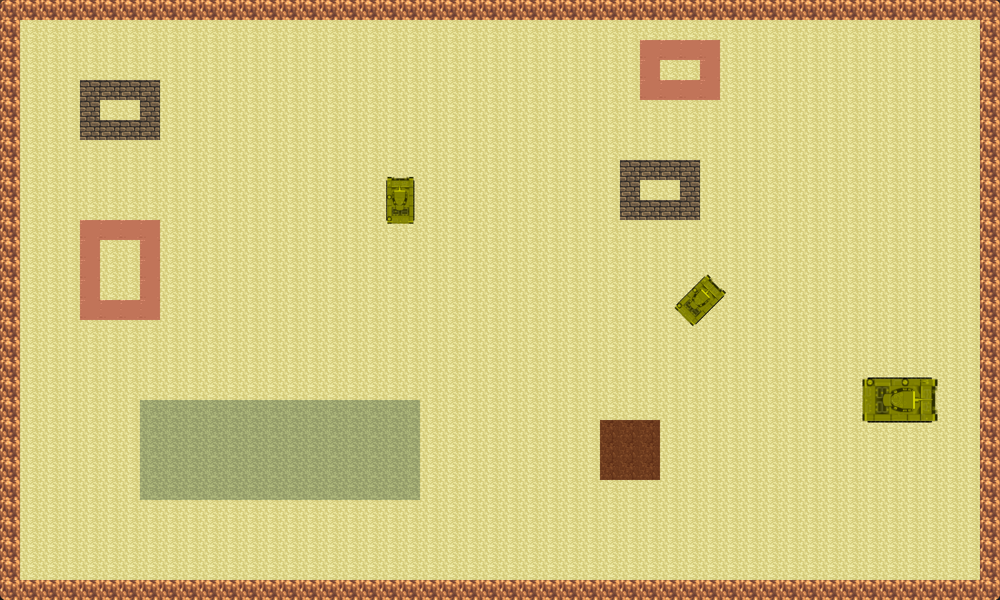

# SDL2TankGame

A work-in-progress tank game built with SDL.

## Features

- [x] Tank Movement
    - [x] Direct movement
    - [x] Chassis rotation
    - [x] Turret rotation
    - [ ] Tank acceleration
- [x] Projectile Movement
    - [x] Direct movement
    - [ ] Acceleration
- [x] Collision Detection
    - [x] Projectile - Tank
    - [x] Projectile - Brick
    - [x] Tank - Brick
    - [x] Tank - Ground Tile
- [x] Multiple Tanks
- [x] Multiple Ammo Types
    - [ ] Different reloading mechanics
- [x] Level Loading
    - [x] Map information
    - [x] Tank information
    - [x] Ammo information
    - [x] Music information
    - [ ] Victory/Defeat detection
    - [ ] Progression to next level
- [x] Dynamic Music
    - [ ] Fade in/out
- [ ] Sound Effects
- [ ] Dynamic Textures
    - [ ] Tank
        - [ ] Destruction animation
    - [ ] Projectile
        - [ ] Flight animation
    - [ ] Brick
        - [ ] Destruction animation
- [ ] AI
- [ ] Rendering Optimizations
- [ ] User Interface

## Controls

- Chassis Movement
    - W - Move forward
    - S - Move backward
    - A - Rotate left
    - D - Rotate right
- Turret Rotation
    - Q - Rotate turret left
    - E - Rotate turret right
- Combat
    - Space - Shoot
    - R - Cycle cartridges

## Dependencies

- [Simple DirectMedia Layer (SDL)](https://github.com/libsdl-org/SDL) | [zlib License](https://github.com/libsdl-org/SDL/blob/main/LICENSE.txt)
- [SDL2 Image](https://github.com/libsdl-org/SDL_image) | [zlib License](https://github.com/libsdl-org/SDL_image/blob/main/LICENSE.txt)
- [SDL2 Mixer](https://github.com/libsdl-org/SDL_mixer) | [zlib License](https://github.com/libsdl-org/SDL_mixer/blob/main/LICENSE.txt)
- [nlohmann/json](https://github.com/nlohmann/json) | [MIT License](https://github.com/nlohmann/json/blob/develop/LICENSE.MIT)

## Resources

- [Lots of free 2d tiles and sprites by Hyptosis](https://opengameart.org/content/lots-of-free-2d-tiles-and-sprites-by-hyptosis)
- [Tank (top view)](https://opengameart.org/content/tank-top-view)
- [Bullet for ammometer](https://opengameart.org/content/bullet-for-ammometer)

## Build Instructions

1. Prerequisites:
   - CMake (3.20 or higher)
   - C++23 compatible compiler
   - SDL2, SDL2_image, and SDL2_mixer libraries
   - nlohmann/json library

2. Clone the repository:
   ```
   git clone https://github.com/uLcdia/SDL2TankGame.git
   cd SDL2TankGame
   ```

3. Build the project:
   ```
   cmake -G Ninja -B build
   cmake --build build
   ```

4. Run the game:
   ```
   ./SDL2TankGame
   ```

> [!IMPORTANT]
> - This game is developed on Linux. Windows users may need to reconfigure CMake.
> - Ensure all required libraries are installed on your system before building.
> - Proprietary music tracks are not included in the assets folder.

## Screenshots




## License

This project is licensed under the MIT License. See the [LICENSE](LICENSE) file for details.

## Project History

> [!NOTE]
> This project originated as a collaborative effort in a C++ course, where I was tasked with developing the game's foundation. After completing my assigned portion, I continued to develop the project independently due to my interest in the concept.
> 
> The collaboration branch extends from commit [6909dd1](https://github.com/uLcdia/SDL2TankGame/commit/6909dd1a6a3ea6262b78a673d38144b7b5821595). The team later incorporated code from this repository into their collaborative work.
> 
> This branch is now solely maintained and developed by me.
